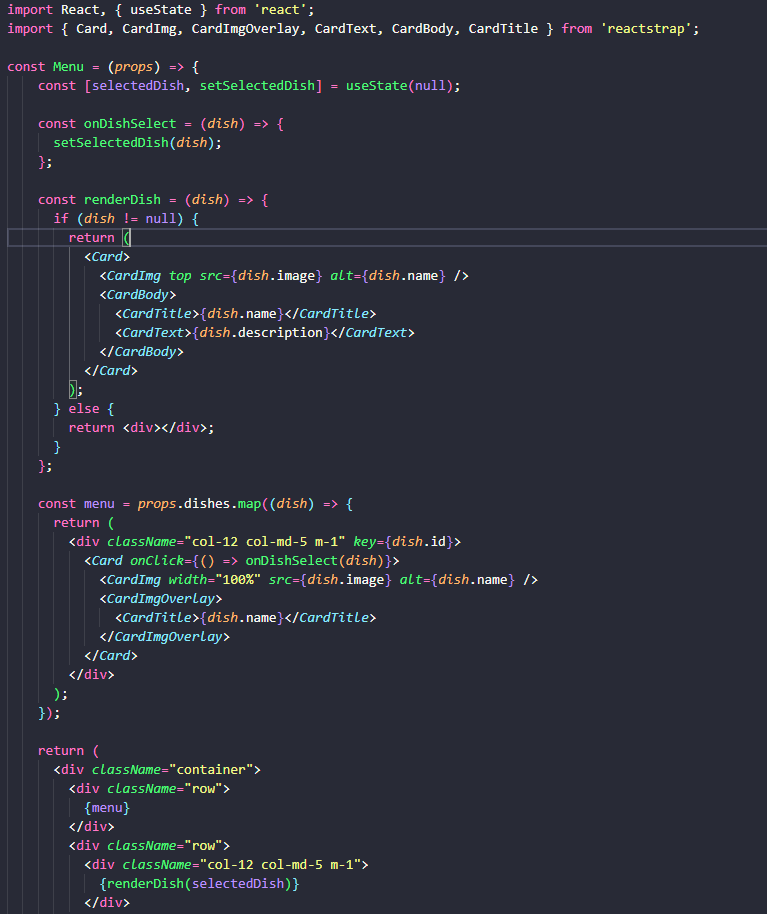
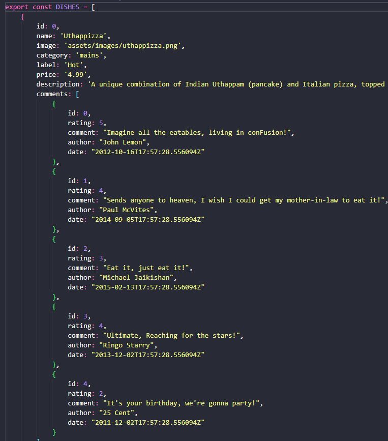
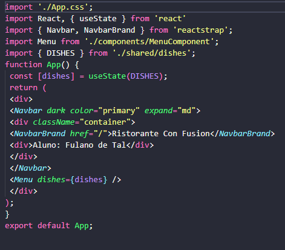

# UC13-Aula10  
### Aluno:Igor Pereira de Araújo
### Professor: Thiago Nogueira
### data:26/11/2024 
## O que foi feito
- alterações nos componentes do menu
- utilização do componente Card para exibir uma lista
- utilização do componente Card para exibir informações detalhadas 

1. Alterações feitas no MenuComponent.js

Esse código que foi modificado da a possibilidade do usuário visualizar um menu de pratos e conseguir selecionar um prato e ver mais detalhes sobre ele utilizando os componentes do React.

Para o funcionamento desse código foi importado alguns componentes de da biblioteca do **React** e do **Reactstrap** como por exemplo o **Card, CardImg, Cardtext** que vão auxiliar na exibição do projeto. Cada componente desse tem sua função especifica que vai auxiliar na exibição final do projeto, o **Card** é utilizado para criar um cartão com uma estrutura de conteúdo flexível que vai ajudar nos outros componentes, e outro exemplo disso é o **CardImg** que é um componente responsável por exibir uma imagem dentro de um Card, assim como o **Cardtext** que tem a função de exibir textos dentro de um Card.
E dentro desse projeto tem vários tipos de funções para um bom funcionamento como o **selecteddish** que é responsável por ser nulo, ele representa o estado onde o usuário ainda não selecionou o prato, já o **onDishselect** é chamado a partir do momento que o usuário selecionou um prato e essa informação vai ser armazenada dentro desse componente.
A partir da seleção do prato o **renderDish** é responsável por renderizar as informações detalhadas de um prato onde ele vai exibir um Card com uma imagem um nome e a descrição do prato.
Já a função do **props.dishes** é responsável por guardar a lista dos pratos, já o comando map é responsável para integrar a lista e gerar um Card de cada prato.

2. O que foi feito no dishes.js:

Basicamente esse arquivo foi desenvolvido para guardar um **array**, no caso a lista dos pratos que vão ser exportados para o menu virtual.

Essas propriedades foram inseridas para dar características e auxiliar na identificação dos pratos como por exemplo o **id** que vai ser o numero identificador do prato, assim como **name** que se trata do nome do prato, **image** vai ser onde vai ser inserido as imagens do prato, **price** que vai ser inserido o valor do prato, entre outras propriedades.
E o tipo de date é com base no formato da ISO 8601 onde ele tem um padrão de exibir a data junto com as horas os minutos e os segundos.

3. O que foi inserido no arquivo app.js

Esse código tem a função de criar uma interface básica para o restaurante.

Basicamente o **const [dishes]** serve para criar um estado para o componente que vai armazenar a lista de pratos .
O comando **< Menu dishes={dishes} / >** tem basicamente a função de armazenar todos os dados da lista de pratos e tem a função de exibir essas informações na interface.

